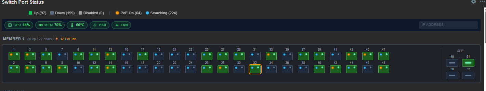
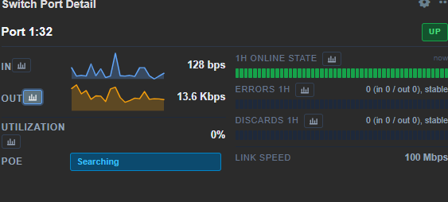

# Zabbix Switch Port Widgets

Three companion Zabbix 7.x dashboard widgets for visualizing Extreme Networks
switches (single units and stacks) as interactive faceplates with drill-down
details and endpoint device lookup.


## The Widgets

| Widget | Role |
|---|---|
| **[Switch Port Status](./switchports/README.md)** | Faceplate overview. Shows every port as a colored icon, a top-line health summary, and a problem count pill. Ports are colored by link speed when up. |
| **[Switch Port Detail](./portdetail/README.md)** | Per-port detail view. Shows traffic sparklines, dashboard-time-aware history bars, and graph-link buttons that drive a Graph (classic) widget. |
| **[Switch Port Device (PacketFence)](./packetfence/README.md)** | Endpoint lookup. Queries Zabbix for MACs learned on the port (via a dot1dTpFdbTable poll), then enriches them with PacketFence node info — vendor, OS, registration status, VLAN, security events. Falls back to Windows DHCP leases when PF has no IP. |

They're designed to work together: click a port in **Switch Port Status**, and
both **Switch Port Detail** and **Switch Port Device** update to show that
port's data. Any widget can also be used independently.

## Screenshot Layout


*(user clicks port 32)*


*(user clicks 📊 next to "IN")*

```
┌─ Graph (classic) ────────────────────────────────────────────────────────┐
│                           Traffic In — Port 32                           │
│                           [line graph here]                              │
└──────────────────────────────────────────────────────────────────────────┘
```

## Quick Start

1. **Deploy the widgets:**
   ```bash
   cd /usr/share/zabbix/ui/modules
   unzip zabbix_switchports_widget.zip
   unzip zabbix_portdetail_widget.zip
   unzip zabbix_packetfence_widget.zip      # optional
   chown -R www-data:www-data switchports portdetail packetfence
   ```

2. **Enable in Zabbix UI:**
   Administration → General → Modules → Scan directory → Enable each one.

3. **Build a dashboard:**
   - Add a **Host Navigator** widget (built-in) so you can pick which switch to view.
   - Add a **Switch Port Status** widget. Set *Override host → Widget → Host Navigator*.
   - Add a **Switch Port Detail** widget. Set *Override host → Widget → Switch Port Status*.
   - Add a **Graph (classic)** widget. Set *Item → Widget → Switch Port Detail*.
   - (Optional) Add a **Switch Port Device (PacketFence)** widget. Set
     *Override host → Widget → Switch Port Status* and configure the
     PacketFence API URL + credentials.

4. **Use it:**
   - Select a host in the Host Navigator → Switch Port Status populates.
   - Click a port → Switch Port Detail and Switch Port Device both populate.
   - Click a chart-icon button in the detail → Graph (classic) renders.

## Data Flow Architecture

```
[Host Navigator] ──_hostid──► [Switch Port Status] ──_hostid──► [Switch Port Detail]
                                                                       │
                                                                       ├─► [Switch Port Device (PacketFence)]
                                                                       │
   click a port in Switch Port Status                                  │
        │                                                              │
        ├─► broadcasts _hostid via ZABBIX.EventHub ───────────────────►┤
        └─► fires DOM event 'sw:portSelected' with snmpIndex ─────────►┤
                                                                       │
                                      click a graph-link button        │
                                            │                          │
                                            └─ broadcasts _itemid ───►[Graph (classic)]
```

- **Host broadcasts** use Zabbix's native EventHub (`_hostid`, `_hostids`).
- **Port selection** piggybacks on the hostid broadcast for wiring, plus a
  custom DOM event (`sw:portSelected`) for the SNMP index since it isn't a
  standard Zabbix broadcast type.
- **Item broadcasts** from Port Detail use `_itemid` / `_itemids`, same types
  the Item Navigator widget uses — so any third-party graph/item widget that
  speaks the standard Zabbix widget protocol works with them.
- **PacketFence lookup** pulls the learned-MAC list out of Zabbix (polled via
  SNMP using a template preprocessing step against `dot1dTpFdbTable` and
  `dot1dBasePortIfIndex`), then posts to `/api/v1/nodes/search` to enrich
  each MAC. When PF has no IP for a device, the widget also reads a
  Windows DHCP lease JSON blob from a separate Zabbix item.

## Why Three Widgets

Zabbix's widget framework is built around lightweight, focused dashboard
components that communicate via broadcasts. Trying to put the faceplate,
per-port detail, and endpoint lookup into a single widget would mean
fetching dozens of items plus external API calls for every port on every
refresh — expensive on a 48-port switch in a stack of 4. Splitting them
keeps the faceplate fast (one batched item query per host), defers heavy
per-port history fetching until a port is selected, and only hits the
PacketFence API when the operator actually wants endpoint info.

## A Note on Scope

This was written for **my environment** — a stack of Extreme Networks switches
monitored by Zabbix 7.x using the stock Extreme EXOS by SNMP template (with
local additions, see below), a PacketFence 15 server for NAC, and a
Windows Server 2022 DHCP server. That shapes some of the specifics: port
discovery skips indices divisible by 1000 because that's where Extreme
puts its management interfaces, item keys match Extreme's template
conventions, and the health strip looks for
`system.cpu.util[extremeCpuMonitorTotalUtilization.0]` and friends.

That said, the code is deliberately simple and should be **easy to adapt for
other vendors**. The item-key prefixes are centralized — change them once and
the widget will discover Cisco, Juniper, Aruba, etc. ports just as happily.
The port-discovery grouping heuristic (gaps > 100 between indices = new stack
member) works for any vendor that uses similar block-allocated ifIndex
schemes, and can be tuned in one spot. The health strip collection function
in `switchports/actions/WidgetView.php` is a single `gatherHealth()` method
where you'd swap in your vendor's sensor keys.

The PacketFence widget is optional and only needed if you run PacketFence
for NAC. The DHCP fallback is optional even within that, and works against
any data source that can be coerced into a JSON `[{mac, ip, hostname,
scope}]` array in a Zabbix item — a Linux `isc-dhcp-server` lease file,
a `dnsmasq` lease file, or a Kea leases query could all substitute for
the Windows PowerShell script that ships with the widget.

If you port this to another vendor, PRs or forks welcome.

### Note on PoE Items

The Extreme EXOS by SNMP template that ships with Zabbix **does not include PoE
items**. I added a PoE discovery rule to my local copy of the template — the
widget's PoE features (per-port dot indicators, PoE fault detection, PoE status
tooltip, "N PoE on" stack summary) all depend on the following items existing
on the host:

| Key | OID | Purpose |
|---|---|---|
| `snmp.interfaces.poe.discovery` | `1.3.6.1.2.1.105.1.1.1.3` | LLDP-MED PoE port discovery |
| `snmp.interfaces.poe.dstatus[{#SNMPINDEX}]` | `1.3.6.1.2.1.105.1.1.1.6.{#SNMPINDEX}` | Per-port PoE detection status |

If your environment doesn't have PoE monitoring set up, the widget still works
fine — it just won't show the PoE dot beneath each port, the PoE rollup in the
stack member header, or PoE-fault port coloring. Everything else (link state,
speed, alias, utilization, errors, discards, health strip) renders normally.

### Note on FDB (MAC-list) Items

The PacketFence widget requires a MAC-list item per port on the switch
template. This is also a local addition — the stock Extreme template
doesn't walk `dot1dTpFdbTable`. The companion packet includes:

- A master SNMP walk item (`fdb.raw`) walking `dot1dTpFdbPort` +
  `dot1dBasePortIfIndex` in one pass every 2 minutes.
- A dependent item prototype (`port.mac.list[{#SNMPINDEX}]`) with a
  JavaScript preprocessing step that correlates the two walks and emits
  a comma-separated MAC list per port.

See the [PacketFence widget README](./packetfence/README.md) for the exact
template configuration.

## Compatibility

- **Zabbix 7.0, 7.2, 7.4** — uses `manifest_version: 2.0`, PHP namespaced
  module structure, `CControllerDashboardWidgetView`.
- **PHP 8.1+** — requires named arguments, `match()`, and `str_starts_with()`.
- Does **not** work on Zabbix 6.x — widget API changed significantly in 7.0.
- Extreme EXOS by SNMP template is recommended for full functionality.
  Other templates work for basic port state display if they use similar key
  patterns (`net.if.status[…]`, `net.if.adminstatus[…]`, etc.). CPU/memory/
  temperature/PSU/fan detail requires matching `sensor.*` and `system.cpu.*`
  keys from Extreme template specifically.
- PacketFence 15 for the device lookup widget (should work on 12–14, untested).
- Windows Server 2022 DHCP for the DHCP fallback (uses the `DhcpServer`
  PowerShell module).

## Development Notes

### The Zabbix "reference" Field

A widget only appears as a broadcast source for other widgets after it has
been **created on the dashboard**. Zabbix assigns each widget a unique
`reference` value when added, which is used by listening widgets to subscribe
to its broadcasts.

**Practical consequence:** any time you change the `manifest.json` `in` or
`out` declarations, you must delete and re-add every existing instance of
that widget on your dashboards. The existing instances were saved to the
database before those declarations existed and have no `reference` field.

### Manifest `in` vs `out` Format

- **`out`** is an array of `{type}` objects:
  `[{"type": "_hostid"}, {"type": "_hostids"}]`
- **`in`** is an **object** keyed by field name:
  `{"override_hostid": {"type": "_hostids"}}`

Getting these wrong is the most common source of "broadcast silently does
nothing" bugs. The field name on the `in` side must match a real
`CWidgetField` in the widget's `WidgetForm`.

### Broadcast Types

From `CWidgetsData`:

| Constant | Wire format |
|---|---|
| `DATA_TYPE_HOST_ID` | `_hostid` |
| `DATA_TYPE_HOST_IDS` | `_hostids` |
| `DATA_TYPE_ITEM_ID` | `_itemid` |
| `DATA_TYPE_ITEM_IDS` | `_itemids` |
| `DATA_TYPE_TIME_PERIOD` | `_timeperiod` |

These match what Zabbix's own widgets (Host Navigator, Item Navigator, Graph,
Dashboard time selector) use.

### File Layout Convention

Every widget directory under `ui/modules/<id>/` needs:

```
<id>/
├── manifest.json                    Required
├── Widget.php                       Optional - if you need a subclass
├── actions/WidgetView.php           Controller (extends CControllerDashboardWidgetView)
├── includes/WidgetForm.php          Config fields (extends CWidgetForm)
├── views/
│   ├── widget.view.php              Presentation
│   └── widget.edit.php              Config dialog
└── assets/
    ├── js/class.widget.js           JS class (extends CWidget)
    └── css/widget.css
```

Zabbix 7.x auto-discovers any directory here that has a valid `manifest.json`.
The module ID must match the directory name.

## Security Note for the PacketFence Widget

The PacketFence widget stores the PF admin password in the Zabbix database
in plaintext (as a widget field value). This is the same risk profile as
any Zabbix item containing credentials or any dashboard macro with sensitive
data, but worth calling out: use a **dedicated read-only PF webservices user**
for this integration, not the primary admin account. See the
[PacketFence widget README](./packetfence/README.md#security-considerations)
for details.

## License

MIT. Contributions welcome.

## See Also

- [Switch Port Status detailed docs](./switchports/README.md)
- [Switch Port Detail detailed docs](./portdetail/README.md)
- [Switch Port Device (PacketFence) detailed docs](./packetfence/README.md)
- [Zabbix 7.x custom widget tutorial](https://www.zabbix.com/documentation/current/en/devel/modules/tutorials/widget)
- [Zabbix widget development guide](https://www.zabbix.com/documentation/current/en/devel/modules/widgets)
